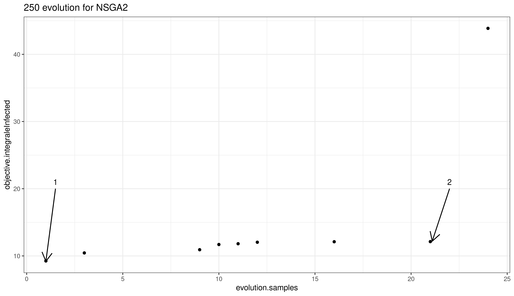
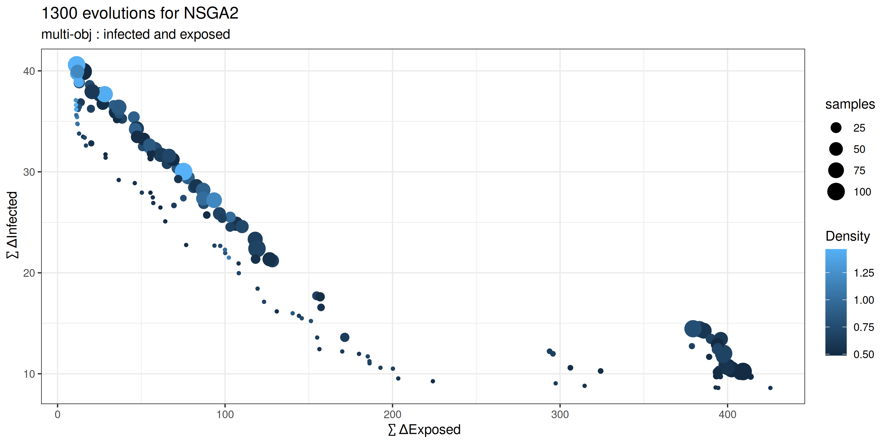
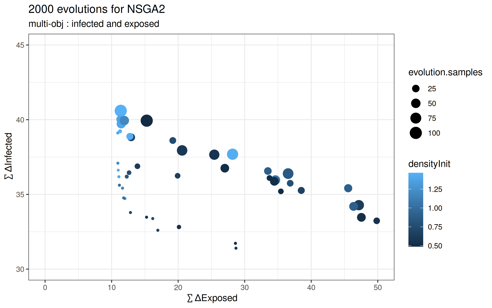
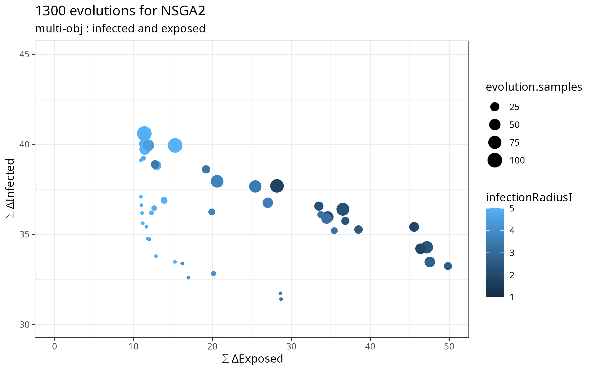
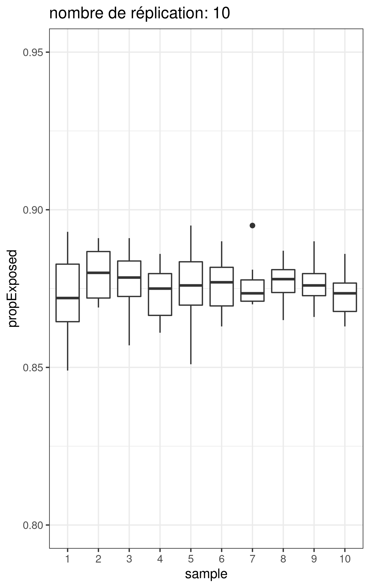
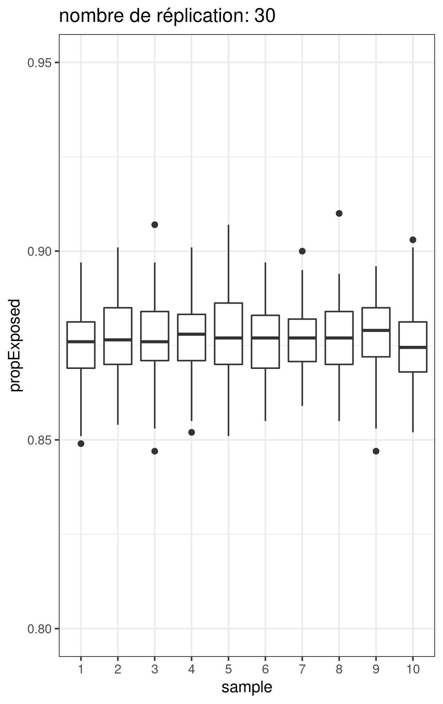
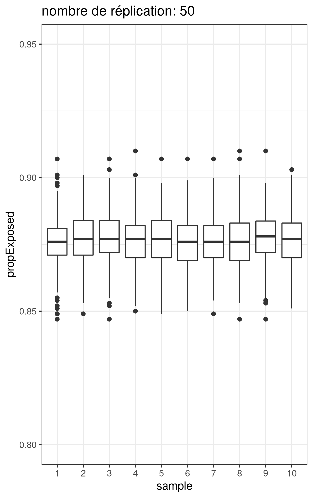
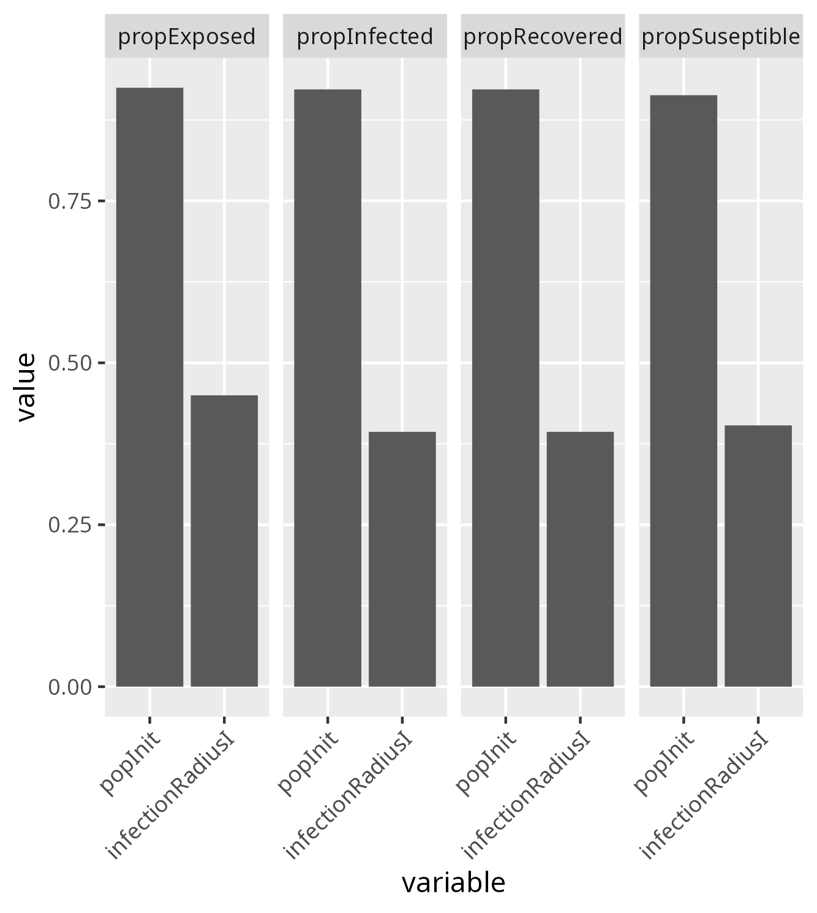
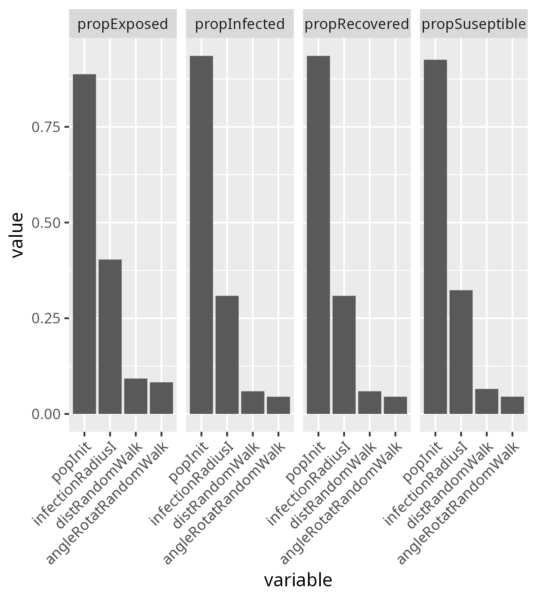

# Work of the reproducibility group : repro-seir 
In this repository we have an implementation of a SEIR model in Netlogo as described [here](Repro_SEIR-1.pdf)


```
data <- read.csv("repro-seir/model/data-EDO-Julia.csv")

infected <- data$value3[round(data$timestamp) == data$timestamp]
write.csv(infected,"github/repro-seir/model/data/infected2.csv", row.names = F, col.names = F)

```

## todo

- There is something to do with space (at least the Moran index). Because there are spatial phenomena that are linked to the movements 
- A partir de result_bs/simple_replication... preprarer les données pour raphaël et tracer la courbe


## ODD (Grimm et al. 2006, 2010)

### Overview
#### Purpose

There are two objectives to this work: 
1. the model SEIR is well known, it is a translation from compartimental model in the concepts of multi-agent simulation The SEIR model is a compartmental model that can be solved by equations. So we will question the translation effects on the reproducibility of the model?
2. By implementing it in an agent-based model, we will question the influence of this translation (in the sense of Latour and Callon). This questioning will push us to use exploration tools to understand the simularity and disimilarity of translation

#### State variables and scales

To perform this translation, we consider only one type of agents, which can be in different states: S (Susceptible), E (Exposed), I (Infectious), R (Recovered).

Globally, we define `te` the mean incubation time, `ti` the mean infection time and `tr` the mean immunity time after infection. 

Each agent will have a private attribute `te`, `ti` and `tr` which will vary randomly following an exponential distribution of variable standard deviation `sd_expo_t`.

Because we are in a multi-agent system, space plays a role in the contagion. So we put in the public variables a contagion distance (`infectionRadius-i`)

The toric space consists of 33x33 cells. The space only serves as a support for the interactions. The agents have no effect on it.

Le pas de temps ... 

#### Process overview and scheduling

As the SEIR model is a compartmentalized model, we have chosen to model it as a finite state machine. 

The agents are in an initial state (S or I), they will go from one state to another following the following process: 
```
S -> E - I - R
^            |
|____________|
```

It is the time (ticks) that will determine the passage from one behavior to another for E, I and R. The passage from S to E is defined by the proximity of agent S with an agent I.

Once the agent has defined the behavior of its state, it will move. All agents move after changing state.

### Design concepts
#### Basic principles

In a finite state automaton, the realized actions are determined according to the events that occur. The action situation and the event defining the next action. The agents have a stack of actions that they will perform one after the other.

#### Emergence

There is an effect of the random movement of agents on the local dynamics of the epidemic. This effect is erased by the density of agents that we can have in the system.

#### Adaptation

Agents do not have the capacity to adapt. It is governed by external stimuli

#### Objectives

The agents have no objectives, they move in the space without goal

#### Learing 

Agents do not have a learning capacity.

#### Prédiction

Agents have no predictive capability

#### Sensing

Agents S are able to perceive agents I. If they perceive them in their perception area (`infectionRadius-i`), they change their state and become E.

#### Interaction

The only implemented interaction is the one that links the agents S and I by their perception

#### Stochastitity

The movement of agents is random. It is this movement that will generate local differences in time and space of the epidemic dynamics.

#### Collectives

Agents do not form groups and have no collective behavior

#### Observation

We collect : 

- the proportion of the population infected (`propInfected`)
- the proportion of the population never infected (`propSuseptible`)
- the proportion of the population exposed to the disease (`propExposed`)
- the proportion of the population in remission and therefore immune for a time (`propRecovered`)

### Details
#### Initialization

At initialization, we generate a (explorable) population of agents, and a proportion (%) of them will be infected (variable and explorable proportion).

#### Input dara

This model does not use data. It is a virtual population.

#### Submodels
As we said in , The agents are in an initial state (S or I), they will go from one state to another following the following process: 
```
S -> E - I - R
^            |
|____________|
```
The succession of steps is managed by a finite state machine architecture, the agents go through the different phases. The SM5 describes the process of movement in the space that is shared by all the states of the automaton.

##### SM1 - S (Susceptible), 
If there are infected agents in a given radius (whose value effect is explored (`infectionRadius-i`)), then the agent count the number of infected neighbors (IN) and draws a probability (A) of being infected in turn. 

If `A < 1 - exp ( - beta * NI)` , then he become Exposed. `beta` is the infection rate.

##### SM2 - E (Exposed)
It is a transitional phase, the exposed agents can no longer be contaminated, but will develop the disease within a variable period of time. During this period (`te`) they are not infectious.

##### SM3 - I (Infectious/infected)
This is a period (`ti`) during which agents are likely to infect other agents in their environment. Once the period of infection is over, it passes in recovered.

##### SM4 - R (Recovered)
The recovered phase is a time (`tr`) during which, the agents cannot be re-infected. Once this time has elapsed, it returns to the suseptible phase.

##### SM5 - movements
Before moving the agents will select a random orientation between 0 and 360 degrees. Then they move forward by 1.

## Some results

### NSGA

#### Mono-objectif sur l'infection


The exploration with the NSGA2 agrorythm shows us that it is difficult to reduce the fitness between the simulated data and the julia data below 12. 

One result allows to reach 9.25, but the number of samples is not sufficient. 

We will therefore focus on the input parameters as being the most likely to reproduce the identified dynamics.

| variable  | value |
|-----------|-------|
|popInit     | 573 |
|propInfecte | 3.834702 |
|teG         | 40.66871 |
|tiG         | 4.1 |
|trG         | 130 |
|infectionRadius | 2 |

Objectifs infected: 12.1

#### Multi Objectifs

it take 1h19 on muse environnement



We see an effect of density. Increasing the density of agents at the beginning of the simulation tends to minimize the distance on the gap to the exposed.



If we now look at the effect of distance to infection, there appears to be an almost linear effect on reducing distance to the curve with those exposed to infections.




|    | evolution.evaluated|   popInit| infectionRadiusI| objective.Infected| objective.Exposed| evolution.samples|
|:---|-------------------:|---------:|----------------:|---------------------------:|--------------------------:|-----------------:|
|4   |               99648|  500.0000|         5.000000|                    39.93565|                   15.27531|               100|
|20  |               99648|  509.4897|         1.098709|                    10.43335|                  402.41404|                77|
|22  |               99648|  760.6908|         1.065601|                    14.42981|                  383.10745|                80|
|25  |               99648|  589.2968|         1.291253|                    14.26530|                  385.76045|                76|
|36  |               99648|  789.5183|         1.000000|                    14.46096|                  379.36289|                96|
|45  |               99648|  500.0000|         1.000000|                    10.22456|                  409.26171|               100|
|80  |               99648| 1469.6906|         1.840862|                    37.68966|                   28.17732|                81|
|81  |               99648|  541.1418|         1.053527|                    10.68018|                  400.03271|                85|
|89  |               99648|  699.4551|         1.371874|                    22.39172|                  119.05545|                99|
|95  |               99648|  699.4551|         1.000000|                    12.01031|                  397.65855|                97|
|119 |               99648| 1500.0000|         1.000000|                    30.02561|                   75.25370|               100|
|142 |               99648| 1500.0000|         5.000000|                    40.59532|                   11.37110|               100|
|151 |               99648| 1216.4995|         1.016900|                    27.18854|                   93.44332|                75|

#### Replication 





We consider that the variability of the results stabilizes after 30 replications. 


### Saltelli exploration 

_20 min on muse environnement_

We used [OpenMole](https://openmole.org/Sensitivity.html#Saltellismethod) to perform a sensitivity analysis on this model using Saltelli's method.

360 sim x 50 grp = 18 000 simulations

#### Total order

The full behavior along the factor for all other possible parameter values. This corresponds to the total effect, i.e. first order but also interactions with other factors.



The initial population and the distance at which the other agents are contaminated play a large role in the variability of the results (0.4 < x < 0.6).

### Pattern Space Exploration (PSE)


## What about Space

### Saltelli exploration


